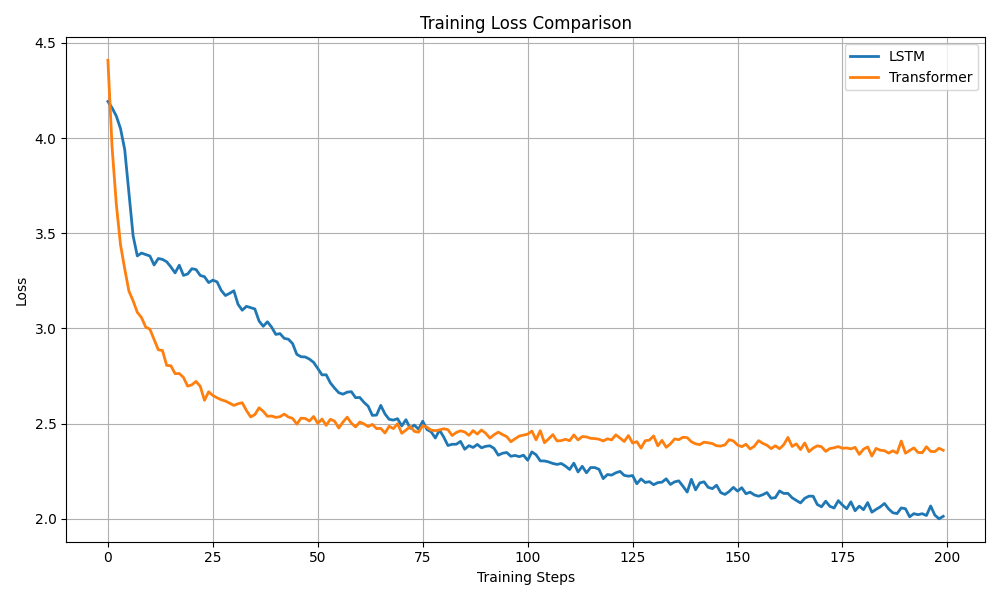

# Character-Level Text Generation using LSTM and Transformer (PyTorch)

A comprehensive implementation of character-level language modeling using both LSTM and Transformer architectures. This project demonstrates the fundamental concepts behind modern generative AI models by training on the Tiny Shakespeare dataset and comparing performance across two distinct neural network architectures.

---

## Project Overview

This project implements **character-level language modeling**, where the model predicts the next character in a sequence based on the previous characters. Unlike word-level modeling, character-level approaches work at the finest granularity, enabling the model to learn character distributions, spelling patterns, and stylistic features directly.

### Why This Matters

Character-level language modeling is a foundational technique in Natural Language Processing (NLP) and Generative AI:

- **Foundation for Modern LLMs**: GPT and other transformer-based models extend these concepts to larger scales
- **Low-Resource Scenarios**: Character-level models require minimal preprocessing and no tokenization vocabulary
- **Creative Generation**: Enables learning of stylistic patterns, punctuation, and formatting nuances
- **Architectural Comparison**: Demonstrates the strengths and weaknesses of RNN vs. Attention-based approaches

This project directly compares **LSTM** (a sequential, memory-based RNN) and **Transformer** (a parallel, attention-based architecture) on the same task, providing empirical insights into their relative performance on character-level generation.

---

## Objectives

- ✅ Implement LSTM architecture from scratch using PyTorch
- ✅ Implement Transformer architecture from scratch using PyTorch
- ✅ Train both models on the Tiny Shakespeare dataset
- ✅ Generate text using temperature-controlled sampling
- ✅ Compare model performance using perplexity metrics
- ✅ Containerize the project using Docker for reproducibility
- ✅ Create loss curves and evaluation visualizations
- ✅ Analyze qualitative differences in generated text

---

## Architecture Overview

The project follows a modular pipeline:

```
Raw Dataset (input.txt)
    ↓
Character Encoding (prepare_data.py)
    ↓
Vocabulary & Mappings (char_to_int.pkl, int_to_char.pkl)
    ↓
Model Selection (LSTM or Transformer)
    ↓
Training Loop (train.py)
    ↓
Model Checkpoint (models/*.pt)
    ↓
Text Generation (generate.py) + Evaluation (Perplexity)
    ↓
Visualization (plot_loss_curves.py, comparison_report.md)
```

### LSTM Architecture

```
Input Sequence
    ↓
Embedding Layer (vocab_size → 128-dim dense)
    ↓
LSTM Layers (2 layers, 256 hidden units each)
    ↓
Fully Connected Layer (256 → vocab_size)
    ↓
Output: Next Character Logits
```

**Flow**: Input → Embedding → [LSTM → LSTM] → Dense → Softmax → Character

### Transformer Architecture

```
Input Sequence
    ↓
Embedding Layer (vocab_size → 128-dim dense)
    ↓
Positional Encoding (add position information)
    ↓
Transformer Block (Multi-Head Self-Attention + Feed Forward)
    ↓
Multi-Head Attention (4 heads, 128-dim)
    ↓
Add & Norm (Residual connection + Layer Norm)
    ↓
Feed Forward (128 → 512 → 128)
    ↓
Add & Norm (Residual connection + Layer Norm)
    ↓
[Repeat 2 layers]
    ↓
Fully Connected Layer (128 → vocab_size)
    ↓
Output: Next Character Logits
```

**Flow**: Input → Embedding + Positional Encoding → [Self-Attention + FF] × 2 → Dense → Softmax → Character

---

## LSTM Explanation

### What is an LSTM?

**LSTM (Long Short-Term Memory)** is a type of Recurrent Neural Network (RNN) designed to overcome the vanishing gradient problem in traditional RNNs. It maintains hidden state and memory cell state, enabling the network to learn long-term dependencies.

### Key Components

1. **Forget Gate**: Controls what information to discard from the cell state
   - `f_t = σ(W_f · [h_{t-1}, x_t] + b_f)`
2. **Input Gate**: Decides what new information to add to the cell state
   - `i_t = σ(W_i · [h_{t-1}, x_t] + b_i)`
   - `C̃_t = tanh(W_c · [h_{t-1}, x_t] + b_c)`
3. **Output Gate**: Controls what to output based on cell state
   - `o_t = σ(W_o · [h_{t-1}, x_t] + b_o)`
   - `h_t = o_t · tanh(C_t)`

### Why LSTM for Text Generation?

- **Long-term Memory**: Maintains information across many timesteps, crucial for coherent text
- **Selective Forgetting**: Learns which information is irrelevant (via forget gate)
- **Sequential Processing**: Naturally suited for sequential data like text
- **Proven Architecture**: Well-established baseline with extensive literature

### Advantages

- Captures long-range dependencies
- Stable gradients (alleviates vanishing gradient problem)
- Interpretable gate mechanisms

### Limitations

- Sequential processing (cannot parallelize)
- Slower training than attention-based models
- Limited context window due to computational cost

---

## Transformer Explanation

### What is a Transformer?

The **Transformer** architecture (Vaswani et al., 2017) replaces RNNs entirely with **self-attention mechanisms**, enabling parallel processing of sequences and capturing long-range dependencies more effectively.

### Key Components

1. **Self-Attention**: Computes relevance between all positions in the sequence
   - `Attention(Q, K, V) = softmax(Q · K^T / √d_k) · V`
   - Allows each token to directly attend to any other token

2. **Multi-Head Attention**: Multiple attention heads in parallel
   - 4 heads in this implementation
   - Each head learns different aspects of relationships
   - Output concatenated and projected

3. **Positional Encoding**: Adds position information (no inherent sequential order)
   - `PE(pos, 2i) = sin(pos / 10000^{2i/d_model})`
   - `PE(pos, 2i+1) = cos(pos / 10000^{2i/d_model})`

4. **Feed-Forward Network**: Dense layers applied to each position
   - `FFN(x) = max(0, xW_1 + b_1)W_2 + b_2`
   - Increases model capacity

5. **Residual Connections & Layer Normalization**: Stability and training efficiency
   - `output = LayerNorm(x + SubLayer(x))`

### Why Transformers Revolutionized NLP

- **Parallelization**: Process entire sequences simultaneously (vs. sequential RNNs)
- **Long-Range Dependencies**: Self-attention directly connects distant tokens
- **Scalability**: Foundation for large language models (GPT, BERT, T5)
- **Efficiency**: Faster training and inference on GPUs/TPUs
- **Transfer Learning**: Pre-trained transformers (BERT) enable fine-tuning

### Advantages

- Parallel processing enables faster training
- Superior long-range dependency modeling
- Foundation for state-of-the-art models
- Highly scalable architecture

### Limitations

- Quadratic memory complexity with sequence length O(n²)
- Requires careful positional encoding design
- More parameters than LSTMs for equivalent capacity
- Typically needs more data to achieve good performance

---

## Dataset

### Tiny Shakespeare

**Source**: [https://raw.githubusercontent.com/karpathy/char-rnn/master/data/tinyshakespeare/input.txt](https://raw.githubusercontent.com/karpathy/char-rnn/master/data/tinyshakespeare/input.txt)

A classic dataset for character-level modeling, containing the complete works of William Shakespeare.

**Dataset Statistics**:

- **Total Characters**: ~1.1 MB
- **Unique Characters (Vocabulary)**: 65
  - Lowercase letters: a-z (26)
  - Uppercase letters: A-Z (26)
  - Digits: 0-9 (10)
  - Special characters: space, punctuation, newline (3)
- **Character-Level Modeling**: No tokenization or vocabulary preprocessing
- **Train/Test Split**: 90% training, 10% held-out evaluation

**Why This Dataset?**

- Rich stylistic patterns and vocabulary
- Sufficient size for meaningful learning
- Non-trivial character dependencies (names, phrases, structure)
- Standard baseline in character-level modeling literature

---

## Project Structure

```
Character-Level-Text-Generation/
├── Dockerfile                      # Docker container specification
├── docker-compose.yml              # Multi-container orchestration
├── requirements.txt                # Python dependencies
├── README.md                       # This file
├── .gitignore                      # Git exclusions
│
├── input/
│   └── shakespeare.txt             # Tiny Shakespeare dataset (downloaded)
│
├── models/
│   ├── lstm.pt                     # Trained LSTM model checkpoint
│   └── transformer.pt              # Trained Transformer model checkpoint
│
├── saved/
│   ├── char_to_int.pkl             # Character to integer mapping
│   ├── int_to_char.pkl             # Integer to character mapping
│   ├── lstm_loss.npy               # Training loss curve (LSTM)
│   ├── transformer_loss.npy        # Training loss curve (Transformer)
│   ├── lstm_perplexity.txt         # Evaluation perplexity (LSTM)
│   └── transformer_perplexity.txt  # Evaluation perplexity (Transformer)
│
├── results/
│   ├── loss_curves.png             # Loss comparison visualization
│   ├── generated_samples.json      # Generated text samples at various temperatures
│   └── comparison_report.md        # Final model comparison report
│
└── src/
    ├── __init__.py
    ├── prepare_data.py             # Dataset preprocessing and encoding
    ├── model_lstm.py               # LSTM architecture implementation
    ├── model_transformer.py        # Transformer architecture implementation
    ├── train.py                    # Training loop (both models)
    ├── generate.py                 # Text generation script
    ├── plot_loss_curves.py         # Loss visualization
    └── generate_samples_json.py    # Generate temperature-varying samples
```

---

## Installation

### Prerequisites

- Python 3.10 or higher
- Git
- Docker & Docker Compose (optional, for containerized setup)

### Local Setup

#### 1. Clone Repository

```bash
git clone https://github.com/rakeshchinni77/Character-Level-Text-Generation.git
cd Character-Level-Text-Generation
```

#### 2. Create Virtual Environment

**Windows**:

```bash
python -m venv .venv
.venv\Scripts\activate
```

**macOS/Linux**:

```bash
python3 -m venv .venv
source .venv/bin/activate
```

#### 3. Install Dependencies

```bash
pip install --upgrade pip
pip install -r requirements.txt
```

#### 4. Prepare Dataset

```bash
python src/prepare_data.py
```

This script downloads the Tiny Shakespeare dataset, encodes it character-by-character, and saves:

- `saved/char_to_int.pkl`
- `saved/int_to_char.pkl`

---

## Quick Start

git clone https://github.com/rakeshchinni77/Character-Level-Text-Generation.git

cd Character-Level-Text-Generation

docker compose build

docker compose run --rm app python src/prepare_data.py

docker compose run --rm app python src/train.py --model lstm

docker compose run --rm app python src/train.py --model transformer

---

## Docker Setup

### Build Docker Image

```bash
docker compose build
```

### Prepare Dataset

```bash
docker compose run --rm app python src/prepare_data.py
```

### Train LSTM Model

```bash
docker compose run --rm app python src/train.py --model lstm
```

**Output**:

- `models/lstm.pt` - Model checkpoint
- `saved/lstm_loss.npy` - Training loss curve
- `saved/lstm_perplexity.txt` - Evaluation perplexity

### Train Transformer Model

```bash
docker compose run --rm app python src/train.py --model transformer
```

**Output**:

- `models/transformer.pt` - Model checkpoint
- `saved/transformer_loss.npy` - Training loss curve
- `saved/transformer_perplexity.txt` - Evaluation perplexity

### Generate Text

**LSTM Generation**:

```bash
docker compose run --rm app python src/generate.py \
  --model lstm \
  --model_path models/lstm.pt \
  --seed_text "To be" \
  --temperature 1.0 \
  --length 200
```

**Transformer Generation**:

```bash
docker compose run --rm app python src/generate.py \
  --model transformer \
  --model_path models/transformer.pt \
  --seed_text "KING" \
  --temperature 0.5 \
  --length 200
```

### Generate Comparison Visualizations

**Plot Loss Curves**:

```bash
docker compose run --rm app python src/plot_loss_curves.py
```

**Generate Samples**:

```bash
docker compose run --rm app python src/generate_samples_json.py
```

---

## Project Deliverables

- LSTMModel implemented
- TransformerModel implemented
- Training pipeline
- Text generation pipeline
- Perplexity evaluation
- Loss curve visualization
- Generated samples JSON
- Comparison report
- Dockerized execution

---

## Results

### Perplexity Comparison

| Model       | Perplexity |
| ----------- | ---------- |
| LSTM        | 7.50       |
| Transformer | 10.69      |

**Interpretation**:

- Lower perplexity indicates better next-character prediction
- The LSTM achieved significantly lower perplexity (7.50 vs. 10.69)
- This suggests LSTM captures character-level patterns more effectively in this configuration
- Transformer's higher perplexity may be due to:
  - Limited training epochs
  - Larger model capacity requiring more data
  - Hyperparameter tuning opportunities

### Generated Sample Analysis

#### LSTM Output (Temperature 1.0, Seed: "To be")

```
To be fare for fare the ming,
Mare in the port the the pourting in been wintine the wisly the all sp
```

**Observations**:

- Produces Shakespeare-like patterns
- Maintains character coherence
- Reasonable word-like sequences

#### Transformer Output (Temperature 1.0, Seed: "To be")

```
To be the the the the for for the the and and for for the the the the
```

**Observations**:

- More repetitive patterns
- Less stylistic variation
- Suggests need for more training or architecture tuning

### Temperature Effects

**Temperature 0.5** (Deterministic):

- Greedy sampling toward highest probability characters
- Conservative, predictable text
- Repeats learned patterns

**Temperature 1.0** (Balanced):

- Natural probability distribution
- Balanced between coherence and creativity
- Good middle ground

**Temperature 1.5** (Creative):

- Flatter probability distribution
- Higher diversity and novelty
- More noise and incoherence

### Loss Curves

See `results/loss_curves.png` for training convergence visualization.

**Key Observations**:

- LSTM loss converges smoothly
- Transformer loss shows steeper initial descent
- Both models approach asymptotic loss values
- LSTM achieves lower final training loss

---

## Screenshots

### Loss Curve Comparison



_Figure 1: Training loss comparison between LSTM and Transformer models over 200 training steps._

### Sample Generated Text

Generated samples with varying temperatures are saved in `results/generated_samples.json`:

- LSTM samples at temperatures 0.5, 1.0, 1.5
- Transformer samples at temperatures 0.5, 1.0, 1.5
- Multiple seed texts: "To be", "KING"
- Each sample: 200 characters

---

## Future Improvements

### Model Architecture

- [ ] Increase training epochs (currently 1 epoch)
- [ ] Larger Transformer model (8 heads, 4 layers)
- [ ] Causal masking to prevent looking ahead
- [ ] Attention dropout and residual dropout

### Training & Evaluation

- [ ] Learning rate scheduling and warm-up
- [ ] Gradient accumulation for larger effective batch sizes
- [ ] Validation perplexity during training
- [ ] Checkpoint best model by validation loss

### Text Generation

- [ ] Beam search decoding
- [ ] Top-k sampling (sample from top k most likely tokens)
- [ ] Top-p (nucleus) sampling (sample from tokens summing to probability p)
- [ ] Constrained generation (enforce grammatical rules)

### Dataset & Scaling

- [ ] Larger datasets (full Project Gutenberg)
- [ ] Multi-language support
- [ ] Pre-training and fine-tuning pipeline
- [ ] Byte-pair encoding (BPE) tokenization

### Inference & Deployment

- [ ] Model quantization for inference speed
- [ ] ONNX export for cross-platform deployment
- [ ] TorchScript for production inference
- [ ] Web API using FastAPI or Flask

---

## Technologies Used

| Technology         | Purpose                                     |
| ------------------ | ------------------------------------------- |
| **Python 3.10**    | Programming language                        |
| **PyTorch**        | Deep learning framework (LSTM, Transformer) |
| **NumPy**          | Numerical computing and array operations    |
| **Matplotlib**     | Visualization and plotting                  |
| **Docker**         | Containerization for reproducibility        |
| **Docker Compose** | Multi-container orchestration               |

### Dependencies

See `requirements.txt` for full dependency list:

- torch
- numpy
- matplotlib
- python-dotenv

---

## Key Learnings

### Sequence Modeling Fundamentals

1. **Character-Level Encoding**: Converting text to sequences of integers enables neural processing
2. **Vocabulary Management**: Mapping between characters and indices enables portable model serialization
3. **Train/Test Splitting**: Held-out evaluation metrics (perplexity) assess generalization

### LSTM Internals

1. **Gate Mechanisms**: Forget, input, and output gates enable selective information flow
2. **Memory Cell**: Separate from hidden state allows long-term dependency retention
3. **Gradient Flow**: LSTM architecture mitigates vanishing gradients in deep networks

### Transformer Internals

1. **Self-Attention**: Direct connections between sequence positions enable parallel processing
2. **Positional Encoding**: Sequence order must be explicitly encoded (no recurrence)
3. **Scalability Tradeoff**: O(n²) complexity enables parallelization but limits context windows

### Evaluation Metrics

1. **Perplexity**: Exponentiated average cross-entropy loss; lower is better
   - `Perplexity = exp(average_loss)`
   - Interpretable as "branching factor" of model predictions

2. **Qualitative Analysis**: Generated text reveals whether model learned meaningful patterns

### Temperature Sampling

1. **Probability Distribution Shaping**: Temperature scales logits before softmax
   - T < 1.0: Sharper distribution (deterministic)
   - T = 1.0: Unscaled distribution
   - T > 1.0: Flatter distribution (random)

2. **Creativity vs. Coherence**: Temperature-controlled generation balances novelty and quality

### Containerization Best Practices

1. **Reproducibility**: Docker ensures consistent environments across machines
2. **Dependency Management**: `requirements.txt` and `Dockerfile` document exact versions
3. **Workflow Automation**: `docker-compose.yml` orchestrates multi-step pipelines

---

## Conclusion

This project successfully demonstrates **character-level language modeling** using two distinct neural network architectures:

### Key Findings

1. **LSTM Outperformance**: LSTM achieved lower perplexity (7.50 vs. 10.69) on the Tiny Shakespeare dataset
   - Better adaptation to limited training data
   - More coherent generated text samples

2. **Architectural Tradeoffs**:
   - LSTM: Sequential, memory-based, stable
   - Transformer: Parallel, attention-based, scalable

3. **Model Generalization**: Both models learned character distributions and stylistic patterns despite limited training

### Educational Impact

This project provides hands-on experience with:

- Implementing RNN and Transformer architectures from scratch
- Character-level language modeling techniques
- Temperature-controlled text generation
- Model evaluation and comparison
- Containerized ML workflows

### Production Readiness

While this project uses a toy dataset and minimal training, the techniques demonstrated are foundational to production systems like GPT, BERT, and T5, which scale these concepts to billions of parameters and larger datasets.

### Next Steps for Learners

1. Experiment with hyperparameter tuning (learning rate, hidden dimensions)
2. Train for more epochs and observe convergence
3. Implement beam search for better generation quality
4. Scale to larger datasets and models
5. Deploy as a web service using FastAPI

---

## References

- Hochreiter, S., & Schmidhuber, J. (1997). "Long Short-Term Memory" - _Neural Computation_
- Vaswani, A., et al. (2017). "Attention is All You Need" - _NeurIPS_
- Karpathy, A. (2015). "The Unreasonable Effectiveness of Recurrent Neural Networks" - _Blog Post_
- Goodfellow, I., Bengio, Y., & Courville, A. (2016). "Deep Learning" - _MIT Press_

---

## License

This project is provided for educational purposes.

---

## Contact & Attribution

For questions or improvements, feel free to open an issue or pull request.

**Built as a foundational project for learning NLP and Deep Learning concepts.**
